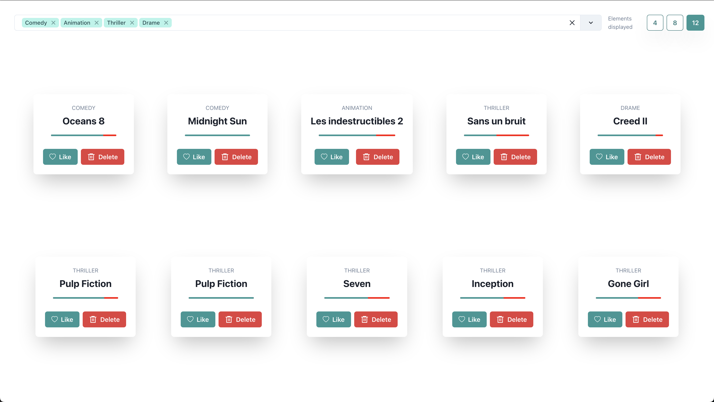
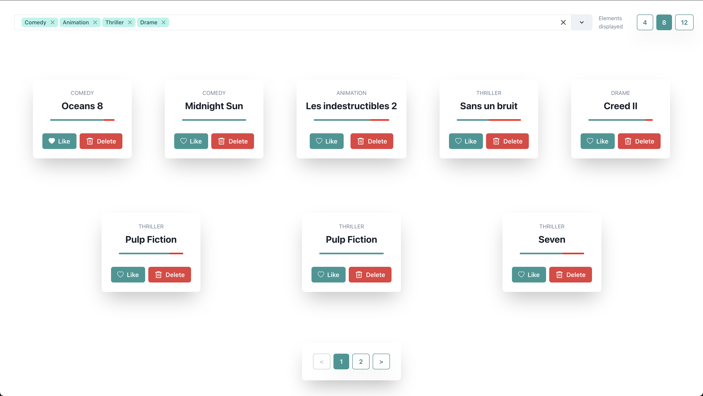

# MoviesList

## Dev Installation

- **With [Yarn](https://classic.yarnpkg.com/en/docs/install/#mac-stable):**

```
yarn
yarn start
```

- **With [NPM](https://www.npmjs.com/get-npm):**

```
npm i
npm start
```

**Enjoy 🎸🎉**

## Description

**MoviesList** is a web app that lists multiple movies, let's you like or delete some and shows the amount of likes and dislikes given to each movie. It also allows you to filter the list by number of elements displayed in the screen, a pagination and by categories. Feel free to play around with the app or to just take a look at the code.

The movies are hard coded in the movies.ts file.




## Library used in this project

### [ChakraUI](https://chakra-ui.com/)

> [ChakraUI](https://chakra-ui.com/) Chakra UI is a simple, modular and accessible component library that gives you the building blocks you need to build your React applications.

### [ReduxToolkit](https://redux-toolkit.js.org/)

> [RTK](https://redux-toolkit.js.org/) The official, opinionated, batteries-included toolset for efficient Redux development

### [Prettier](https://github.com/prettier/prettier#readme)

> Consistent code style

### [TO DO]

> Could be a good idea to add user authentification
